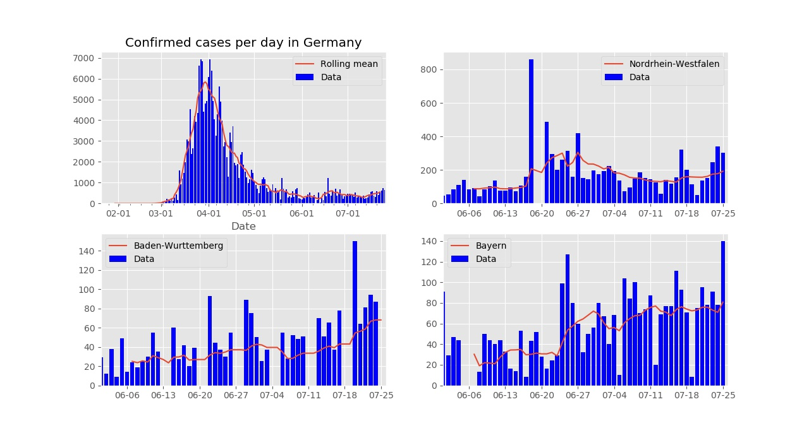

# Make time series plots of COVID-19 latest data from Johns Hopkins database

To use:

* Download/clone the two python source codes to the same folder:
```
$ git clone https://github.com/balintradics/covidplots.git
```

* Edit `makeplots_auto.py`, add more or fewer countries/provinces:

```
from COVID_plots import *

country = "Germany"
provinces = ["Nordrhein-Westfalen", "Bayern", "Baden-Wurttemberg"]
plot_data(country = country, provinces = provinces)

country = "US"
provinces = ["New York", "Florida", "Texas", "California", "Washington"]
plot_data(country = country, provinces = provinces)

print_provinces("Germany")
```

* Run `makeplots_auto.py` with python3:
```
$ python makeplots_auto.py
```
* When rerunning them next time, the code will read the data from the
local `data` folder

Note: Sometimes Johns Hopkins updates the github csv files retrospectively. In this case
just delete all files from the automatically created `data` subfolder and the code will 
redownload them fresh.


